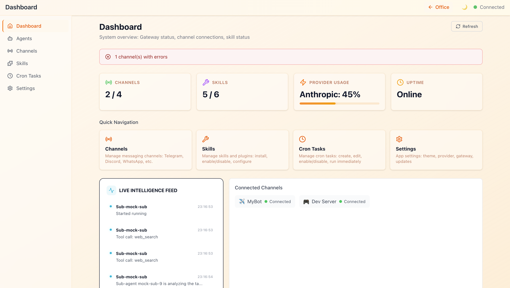
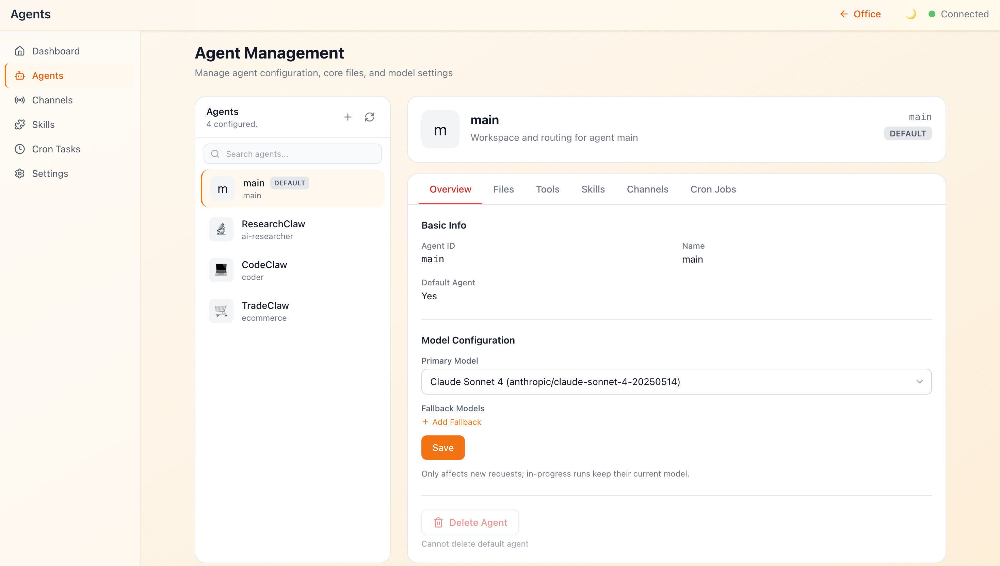
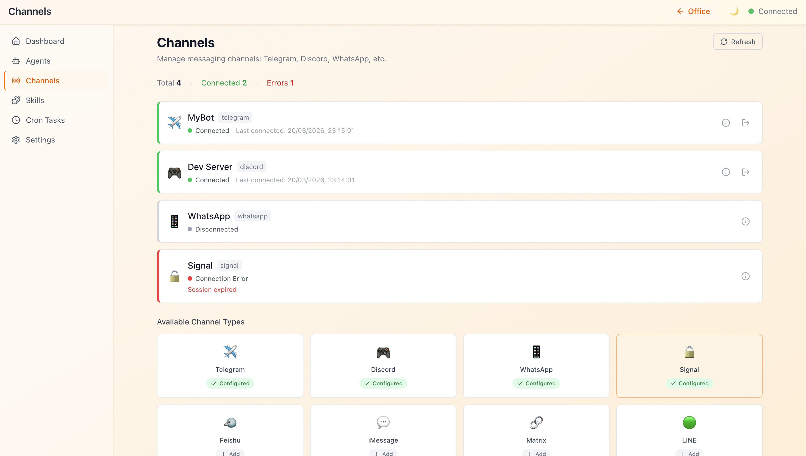
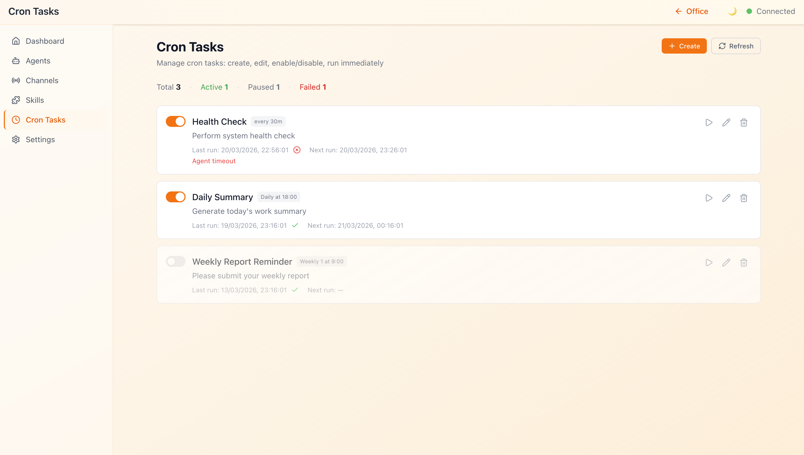

# ClawNexus Office — AI Agent Visualization & Management Platform

> **Real-time digital office visualization for multi-agent AI systems. Monitor, control, and collaborate with AI agents through an immersive 2D interface built on OpenClaw.**

**ClawNexus Office** is a professional-grade visual monitoring and management frontend for the [OpenClaw](https://github.com/openclaw/openclaw) Multi-Agent system. It connects to the OpenClaw Gateway via WebSocket and renders your AI agent fleet as an interactive digital office — giving operators a live, spatial view of every agent's state, conversation, tool activity, and performance metrics alongside a full system management console.

**Install in seconds:**
```bash
npx clawnexus
```

**Core Metaphor:** Agent = Digital Employee | Office = Agent Runtime | Desk = Session | Meeting Pod = Collaboration Context

---

## Key Features

ClawNexus combines three powerful layers:
1. **🏢 Virtual Office** — Immersive 2D floor plan with live agent avatars and collaboration visualization
2. **📊 Analytics & Insights** — Real-time metrics, token tracking, cost breakdown, and activity heatmaps
3. **⚙️ System Console** — Complete control over agents, channels, skills, cron jobs, and configurations

---

### Virtual Office — 2D AI Agent Visualization Engine

Transform your multi-agent AI system into a live, interactive digital office:

- **SVG Floor Plan** — Isometric 2D office scene with desk zones, meeting areas, and realistic furniture (desks, chairs, sofas, plants, coffee cups, meeting tables)
- **Dynamic Agent Avatars** — Deterministically generated SVG avatars from agent IDs, with real-time status animations across five states: `idle`, `working`, `speaking`, `tool_calling`, and `error`
- **Collaboration Visualization** — Live connection lines rendering inter-agent message flow and session relationships
- **Live Speech Bubbles** — Real-time Markdown text streaming and tool call display as HTML overlays directly above agent desks
- **Zone Labels & Desk Units** — Named office zones with individual desk assignments per agent session
- **Agent Movement Animation** — Smooth avatar transitions as agents change state or move between desk zones

### Analytics Panels

In-depth observability for every agent without leaving the office view:

- **Agent Detail Panel** — Identity, model, active session, assigned skills, and current tool status
- **Token Line Chart** — Real-time token consumption history per agent (Recharts)
- **Cost Pie Chart** — Cost breakdown visualization across agents and models
- **Activity Heatmap** — Agent activity density over time
- **Event Timeline** — Chronological event log for agent lifecycle, tool calls, and errors
- **Sub-Agent Relationship Graph** — Network graph visualizing agent spawning and delegation hierarchies

### Real-time Chat Interface

Seamless bottom-docked communication panel for direct agent interaction:

- **Multi-agent Selector** — Switch target agents and sessions without losing context
- **Streaming Message Display** — Watch AI responses generate token-by-token with full Markdown rendering
- **Chat History Drawer** — Timeline-based conversation replay with full message history
- **Session Switcher** — Navigate between active and past sessions per agent
- **Abort Control** — Interrupt in-flight agent runs instantly
- **Streaming Indicator** — Visual feedback during response generation

### Demo Video

[](https://www.youtube.com/watch?v=4Vq2vqMlC6Y)

**Watch the ClawNexus Office in action** — Real-time agent visualization, live collaboration tracking, and instant system control.

---

## ⚡ Get Started in 30 Seconds

```bash
# 1. Install and run (auto-detects your OpenClaw Gateway)
npx clawnexus

# 2. Open browser (automatically opens)
# http://localhost:5180

# 3. Start monitoring your AI agents!
```

**Prerequisites:** Node.js 22+ | OpenClaw Gateway running locally

**That's it!** No configuration files, no setup wizard — just run and go.

### Management Console — Full System Control

A complete operator console for managing every aspect of your OpenClaw deployment.

#### Dashboard — System Overview
Get instant visibility into your deployment with stat cards, real-time alerts, channel and skill summaries, plus a quick-navigation grid and live activity feed.



#### Agents — Full Control
Create, manage, and monitor agents with comprehensive detail tabs for configuration, assigned channels, active skills, tool calls, scheduled cron jobs, and file management.



#### Channels — Multi-Integration Support
Connect to messaging platforms (Telegram, Discord, WhatsApp, Signal, Slack, Matrix, LINE) with channel cards, configuration dialogs, status monitoring, and QR code binding flows.



#### Skills — Marketplace & Management
Discover and install skills from the ClawHub marketplace directly in the console. Manage dependencies, enable/disable skills, and configure skill-specific settings.


#### Cron Tasks — Scheduled Automation
Create and manage scheduled tasks with a visual cron editor, preset templates, execution history, and real-time status monitoring.



#### Settings — Full Configuration
Configure LLM providers (OpenAI, Anthropic, Claude, custom), manage API keys, set appearance preferences, connect to remote gateways, and access developer tools.


### Platform Features

- **ClawHub Marketplace** — Discover and install skills from the ClawHub registry directly from the console
- **Provider Management** — Add and configure LLM providers (OpenAI, Anthropic, and custom) with per-model settings
- **Connection Setup Dialog** — First-run guided Gateway connection wizard with token auto-detection
- **Mock Mode** — Full development environment with simulated agent data, no live Gateway required
- **Workspace Customization** — Appearance and layout preferences persisted locally
- **Toast Notifications** — Non-blocking operator feedback for system events and errors
- **Remote Gateway Support** — Connect to local, LAN, or cloud-hosted OpenClaw deployments
- **i18n Foundation** — Internationalization architecture with English locale across all UI namespaces

---

## Why ClawNexus?

| Feature | ClawNexus | Traditional Dashboards |
| --- | --- | --- |
| **Visual Workspace** | Interactive 2D office with avatars and collaboration lines | Static tables and charts |
| **Real-time Updates** | Live WebSocket events, instant state changes | Polling-based, delayed updates |
| **Spatial Navigation** | Agents arranged in office zones, zones = context | Linear agent lists |
| **Collaboration Tracking** | Visual connections between agents, see who's talking to whom | Message logs only |
| **Token Tracking** | Per-agent token consumption with cost breakdown | Aggregate usage only |
| **Complete Control** | Manage agents, channels, skills, cron jobs all in one place | Multiple separate tools |
| **Mobile Friendly** | Responsive design works on tablets and laptops | Desktop-only typically |
| **Open Source** | Transparent, extensible, community-driven | Vendor lock-in |

---

## Tech Stack

| Layer | Technology |
| --- | --- |
| **Language** | TypeScript (strict mode, ESM) |
| **Framework** | React 19 |
| **Build Tool** | Vite 6 |
| **State Management** | Zustand 5 + Immer |
| **Styling** | Tailwind CSS 4 |
| **2D Rendering** | SVG + CSS Animations |
| **Routing** | React Router 7 (HashRouter) |
| **Data Visualization** | Recharts |
| **Markdown** | react-markdown + remark-gfm |
| **Icons** | Lucide React |
| **i18n** | i18next + react-i18next |
| **Real-time** | Native WebSocket API (OpenClaw Gateway protocol) |
| **Testing** | Vitest + React Testing Library |

---

## System Requirements

### For running ClawNexus

- **Node.js 22+** — LTS or current stable
- **npm/pnpm** — Package manager (comes with Node.js)

### For connecting to OpenClaw

- **[OpenClaw Gateway](https://github.com/openclaw/openclaw)** — 2026.2.15 or later, running and accessible
- **Gateway Auth Token** — Automatically detected from `~/.openclaw/openclaw.json` or provide via `-t` flag
- **Device Auth Bypass** — Enable with: `openclaw config set gateway.controlUi.dangerouslyDisableDeviceAuth true`

> **Note:** ClawNexus is a companion frontend only. It connects to a running OpenClaw Gateway and does not start or manage it.

---

## Quick Start

### Option A: Install from npm (Recommended for Production) 🚀

The easiest way to run ClawNexus is via npm without any configuration:

```bash
npx clawnexus
```

This command:
1. Downloads the latest ClawNexus build
2. Starts the web server on `http://localhost:5180`
3. Automatically detects your local OpenClaw Gateway token
4. Opens your browser to the dashboard

**Custom Configuration:**

```bash
npx clawnexus --gateway ws://my-gateway.com:18789 --port 3000
```

**All CLI Options:**

| Flag | Description | Default |
| --- | --- | --- |
| `-t, --token <token>` | Gateway authentication token | auto-detected from `~/.openclaw/openclaw.json` |
| `-g, --gateway <url>` | Gateway WebSocket URL | `ws://localhost:18789` |
| `-p, --port <port>` | Server HTTP port | `5180` |
| `--host <host>` | Server bind address | `0.0.0.0` |
| `-h, --help` | Show help message | — |

**Install Globally (optional):**

```bash
npm install -g clawnexus
clawnexus  # Run from anywhere
```

### Option B: Clone & Develop Locally 💻

For development, customization, or running from source:

```bash
git clone https://github.com/prantikmedhi/openclaw-office
cd openclaw-office
pnpm install
```

### Configure Gateway Connection

Create `.env.local` (gitignored) with your Gateway token:

```bash
cat > .env.local << 'EOF'
VITE_GATEWAY_TOKEN=<your-gateway-token>
VITE_GATEWAY_URL=ws://localhost:18789
EOF
```

Get your token:

```bash
openclaw config get gateway.auth.token
```

### Enable Device Auth Bypass

Required for web clients (Gateway 2026.2.15+):

```bash
openclaw config set gateway.controlUi.dangerouslyDisableDeviceAuth true
# Restart Gateway after this change
```

### Start Development Server

```bash
pnpm dev
```

Opens `http://localhost:5180` with hot reload. Code changes instantly reflect in the browser.

**Development Commands:**

```bash
pnpm build      # Production build
pnpm test       # Run tests
pnpm typecheck  # TypeScript validation
pnpm lint       # Code analysis
pnpm format     # Auto-format code
```

---

## Development Commands

```bash
pnpm install              # Install dependencies
pnpm dev                  # Start dev server (port 5180) with hot reload
pnpm build                # Production-optimized build
pnpm test                 # Run test suite
pnpm test:watch           # Watch mode testing
pnpm typecheck            # TypeScript validation
pnpm lint                 # Oxlint code analysis
pnpm format               # Oxfmt code formatting
pnpm check                # Combined lint + format check
```

---

## Gateway Connection Modes

### Local Gateway (Default)

ClawNexus automatically connects to OpenClaw running on your machine:

```bash
# Automatic (no flags needed)
npx clawnexus

# Token and Gateway URL auto-detected from ~/.openclaw/openclaw.json
# Connects to ws://localhost:18789 by default
```

### Remote Gateway

Connect to hosted OpenClaw environments (cloud, LAN, remote servers):

```bash
npx clawnexus \
  --gateway ws://my-gateway.example.com:18789 \
  --token YOUR_AUTH_TOKEN
```

### Automatic Token Detection

If [OpenClaw](https://github.com/openclaw/openclaw) is installed locally, the Gateway auth token is automatically read from `~/.openclaw/openclaw.json` — no manual setup required.

### Connection Setup Dialog

On first launch, ClawNexus shows a connection wizard to:
- Verify Gateway connectivity
- Input or confirm auth tokens
- Test the connection before proceeding
- Save settings for future launches

### Configuration Priority

ClawNexus resolves settings in this order:

1. **CLI flags** — `--token`, `--gateway`, `--port` (highest priority)
2. **Environment variables** — `OPENCLAW_GATEWAY_TOKEN`, `OPENCLAW_GATEWAY_URL`
3. **Config file** — `~/.openclaw/openclaw-office.json` (persisted from previous runs)
4. **Defaults** — `ws://localhost:18789` (Gateway), auto-detected token (lowest priority)

**Example with environment variables:**

```bash
export OPENCLAW_GATEWAY_TOKEN=your-token-here
export OPENCLAW_GATEWAY_URL=ws://10.0.0.5:18789
npx clawnexus
```

---

## Project Architecture

```
openclaw-office/
├── src/
│   ├── main.tsx / App.tsx              # Entry point and route definitions
│   ├── i18n/                           # i18next config + English locale files
│   │   └── locales/en/                 # common, layout, office, panels, chat, console
│   ├── gateway/                        # OpenClaw Gateway communication layer
│   │   ├── ws-client.ts                # WebSocket client
│   │   ├── ws-adapter.ts               # Auth, reconnect, and session handling
│   │   ├── rpc-client.ts               # RPC request/response wrapper
│   │   ├── event-parser.ts             # Event parsing and agent state mapping
│   │   ├── adapter.ts / adapter-provider.ts  # Adapter pattern (real / mock)
│   │   ├── mock-adapter.ts             # Simulated data for development
│   │   └── clawhub-client.ts           # ClawHub marketplace API client
│   ├── store/                          # Zustand state management
│   │   ├── office-store.ts             # Main store: agents, metrics, UI state
│   │   ├── agent-reducer.ts            # Agent state transition logic
│   │   ├── metrics-reducer.ts          # Metrics computation
│   │   ├── meeting-manager.ts          # Agent collaboration tracking
│   │   ├── toast-store.ts              # Toast notification state
│   │   └── console-stores/             # Per-page console stores
│   │       ├── agents-store.ts
│   │       ├── channels-store.ts
│   │       ├── skills-store.ts / clawhub-store.ts
│   │       ├── cron-store.ts
│   │       ├── dashboard-store.ts
│   │       ├── settings-store.ts
│   │       ├── chat-dock-store.ts
│   │       └── config-store.ts
│   ├── components/
│   │   ├── layout/                     # AppShell, ConsoleLayout, Sidebar, TopBar
│   │   ├── office-2d/                  # 2D SVG floor plan + furniture components
│   │   │   ├── FloorPlan.tsx
│   │   │   ├── AgentAvatar.tsx
│   │   │   ├── DeskUnit.tsx
│   │   │   ├── ConnectionLine.tsx
│   │   │   ├── ZoneLabel.tsx
│   │   │   └── furniture/              # Desk, Chair, Sofa, Plant, CoffeeCup, MeetingTable
│   │   ├── overlays/                   # SpeechBubble HTML overlay
│   │   ├── panels/                     # AgentDetailPanel, MetricsPanel, charts, timeline
│   │   ├── chat/                       # ChatDockBar, AgentSelector, MessageBubble, etc.
│   │   ├── console/                    # Console feature components by domain
│   │   │   ├── agents/                 # List, detail header, tabs (Overview/Channels/Skills/Tools/Cron/Files)
│   │   │   ├── channels/               # Cards, config dialog, stats, WhatsApp QR flow
│   │   │   ├── skills/                 # Marketplace cards, detail/install dialogs, ClawHub integration
│   │   │   ├── cron/                   # Task cards, create/edit dialog, stats bar
│   │   │   ├── dashboard/              # Stat cards, alert banner, quick nav, activity feed
│   │   │   ├── settings/               # Provider CRUD, model editor, appearance, gateway, about
│   │   │   └── shared/                 # StatusBadge, LoadingState, EmptyState, ErrorState, ConfirmDialog
│   │   ├── pages/                      # Console route page containers
│   │   └── shared/                     # Avatar, SvgAvatar, ToastContainer, ConnectionSetupDialog, etc.
│   ├── hooks/                          # useGatewayConnection, useResponsive, useSidebarLayout, etc.
│   ├── lib/                            # Utilities: avatar-generator, position-allocator, movement-animator,
│   │   │                               #   gateway-url, local-persistence, cron-presets, provider-types, etc.
│   └── styles/
│       └── globals.css                 # Global Tailwind + custom styles
├── bin/                                # Node.js server and CLI configuration utilities
├── public/                             # Static assets
├── tests/                              # Test files
└── vite.config.ts / tsconfig.json / vitest.config.ts
```

---

## System Architecture

**Data Flow:** OpenClaw Gateway → WebSocket → Event Parser → Zustand Store → React Components

```
OpenClaw Gateway
    │
    ├─ WebSocket Events ──> ws-adapter.ts ──> event-parser.ts ──┐
    │                                                             ├──> Zustand Store ──> React UI
    └─ RPC Methods ──────> rpc-client.ts ──────────────────────-┘
```

**Event Processing Pipeline:**
1. Gateway broadcasts real-time events: `agent`, `presence`, `health`, `heartbeat`
2. `event-parser.ts` maps agent lifecycle events to visual states (`idle`, `working`, `speaking`, `tool_calling`, `error`)
3. Zustand store applies updates atomically via reducers
4. React components re-render the office floor plan, speech bubbles, and panels

**Agent State Mapping:**

| Gateway Stream | Key Field | Frontend State | Visual |
| --- | --- | --- | --- |
| `lifecycle` | `phase: "start"` | `working` | Loading animation |
| `lifecycle` | `phase: "end"` | `idle` | Idle state |
| `tool` | `name: "..."` | `tool_calling` | Tool panel popup |
| `assistant` | `text: "..."` | `speaking` | Markdown speech bubble |
| `error` | `message: "..."` | `error` | Red error indicator |

---

## Environment Variables

Used in local development (via `.env.local`):

| Variable | Required | Default | Purpose |
| --- | --- | --- | --- |
| `VITE_GATEWAY_TOKEN` | Yes (real Gateway) | — | OpenClaw Gateway auth token |
| `VITE_GATEWAY_URL` | No | `ws://localhost:18789` | Dev Gateway upstream address |
| `VITE_MOCK` | No | `false` | Enable mock mode (no Gateway needed) |
| `VITE_CLAWHUB_REGISTRY` | No | `https://clawhub.com` | ClawHub marketplace registry URL |

### Mock Mode — Develop Without a Gateway

Test and develop the full UI without needing a running OpenClaw Gateway:

```bash
# Run with simulated data
VITE_MOCK=true pnpm dev

# Or with npm
VITE_MOCK=true npx clawnexus
```

This is great for UI development, testing, and demos.

---

## Testing

Run the test suite to ensure your changes work correctly:

```bash
pnpm test              # Run all tests once
pnpm test:watch        # Watch mode (re-run on changes)
pnpm test:coverage     # Generate coverage report
```

**Test Coverage:**
- Store logic and state management (Zustand)
- Event parsing and Gateway protocol handling
- Component interactions and rendering (React Testing Library)
- Critical data flows and edge cases

**Tips:**
- Use `test:watch` during development for instant feedback
- Add tests when fixing bugs or adding features
- Check coverage to identify untested code paths

---

## Troubleshooting

### ❌ Cannot connect to Gateway

**Symptom:** "Connection refused" or "WebSocket error"

**Solution:**

```bash
# 1. Verify Gateway is running
openclaw gateway status

# 2. Check Gateway is on correct port
curl http://localhost:18789/health

# 3. Get and verify your auth token
openclaw config get gateway.auth.token

# 4. Enable device auth bypass (required for web clients)
openclaw config set gateway.controlUi.dangerouslyDisableDeviceAuth true

# 5. Restart Gateway
openclaw gateway restart

# 6. Try connecting with explicit token and gateway
npx clawnexus --token YOUR_TOKEN --gateway ws://localhost:18789
```

### ❌ Port 5180 already in use

**Symptom:** "Address already in use" error

**Solution:**

```bash
# Run on a different port
npx clawnexus --port 5181

# Or kill the process using port 5180
lsof -i :5180
kill -9 <PID>
```

### ❌ Cannot auto-detect token

**Symptom:** "No token found" or "token missing"

**Solution:**

```bash
# Provide token explicitly
npx clawnexus --token $(openclaw config get gateway.auth.token)

# Or set environment variable
export VITE_GATEWAY_TOKEN=$(openclaw config get gateway.auth.token)
pnpm dev
```

### ❌ TypeScript errors (development)

**For developers working from source:**

```bash
# Check types
pnpm typecheck

# Fix type issues
pnpm lint --fix
pnpm format
```

### ❌ Mock mode not working

**To develop without a Gateway:**

```bash
# For npm install
VITE_MOCK=true npx clawnexus

# For local development
VITE_MOCK=true pnpm dev
```

### Getting Help

- Check OpenClaw docs: [github.com/openclaw/openclaw](https://github.com/openclaw/openclaw)
- Report issues: [github.com/prantikmedhi/openclaw-office/issues](https://github.com/prantikmedhi/openclaw-office/issues)
- Join OpenClaw community channels for support

---

## License & Attribution

**© 2026 [Prantik Medhi](https://github.com/prantikmedhi)**

All code, design, and documentation are created and maintained by Prantik Medhi. Licensed under [MIT](./LICENSE).

This project is a companion frontend for the [OpenClaw](https://github.com/openclaw/openclaw) multi-agent framework.

---

## What's Next?

After getting ClawNexus running, here are some things you can do:

### For Operators

1. **Connect Your Agents** — Go to the Agents console and create or connect your first AI agent
2. **Set Up Channels** — Configure messaging channels (Telegram, Discord, WhatsApp, etc.) for your agents
3. **Install Skills** — Browse the ClawHub marketplace and install skills your agents need
4. **Schedule Tasks** — Create cron jobs for automated agent workflows
5. **Monitor Metrics** — Watch the Dashboard for real-time system health and performance

### For Developers

1. **Read [CLAUDE.md](./CLAUDE.md)** — Deep dive into architecture and development patterns
2. **Explore the Code** — Start with `src/main.tsx` and the store architecture
3. **Modify Features** — Customize the office visualization or add new console pages
4. **Write Tests** — Add test coverage for your changes
5. **Contribute** — Submit pull requests with improvements

### Common Next Steps

- **Set Gateway URL** — If running remote OpenClaw: `npx clawnexus --gateway ws://your-server:18789`
- **Add Providers** — Settings → AI Providers → Add OpenAI, Anthropic, or custom models
- **Enable Mock Mode** — `VITE_MOCK=true pnpm dev` for UI development without Gateway
- **Check Logs** — Monitor console output for debugging and performance insights

---

## Contributing

Contributions are welcome. Please follow the coding standards in [CLAUDE.md](./CLAUDE.md).

- Fork the repository
- Create a feature branch (`git checkout -b feature/your-feature`)
- Commit using [Conventional Commits](https://www.conventionalcommits.org/)
- Open a Pull Request

---

## Documentation

- [CLAUDE.md](./CLAUDE.md) — Detailed architecture and development guide
- [OpenClaw Repository](https://github.com/openclaw/openclaw) — Gateway protocol and API reference

---

**Made with care by [Prantik Medhi](https://github.com/prantikmedhi)**
