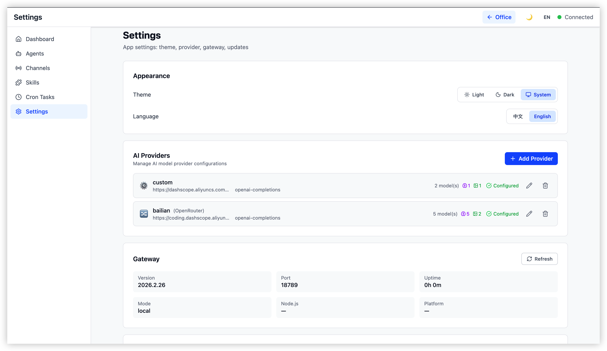

# ClawNexus Office — AI Agent Visualization & Management Platform

> **Real-time digital office visualization for multi-agent AI systems. Monitor, control, and collaborate with AI agents through an immersive 2D interface built on OpenClaw.**

**ClawNexus Office** is a professional-grade visual monitoring and management frontend for the [OpenClaw](https://github.com/openclaw/openclaw) Multi-Agent system. It connects to the OpenClaw Gateway via WebSocket and renders your AI agent fleet as an interactive digital office — giving operators a live, spatial view of every agent's state, conversation, tool activity, and performance metrics alongside a full system management console.

**Core Metaphor:** Agent = Digital Employee | Office = Agent Runtime | Desk = Session | Meeting Pod = Collaboration Context

---

## Key Features

### Virtual Office — 2D AI Agent Visualization Engine

Transform your multi-agent AI system into a live, interactive digital office:

- **SVG Floor Plan** — Isometric 2D office scene with desk zones, meeting areas, and realistic furniture (desks, chairs, sofas, plants, coffee cups, meeting tables)
- **Dynamic Agent Avatars** — Deterministically generated SVG avatars from agent IDs, with real-time status animations across five states: `idle`, `working`, `speaking`, `tool_calling`, and `error`
- **Collaboration Visualization** — Live connection lines rendering inter-agent message flow and session relationships
- **Live Speech Bubbles** — Real-time Markdown text streaming and tool call display as HTML overlays directly above agent desks
- **Zone Labels & Desk Units** — Named office zones with individual desk assignments per agent session
- **Agent Movement Animation** — Smooth avatar transitions as agents change state or move between desk zones

### Analytics Panels

In-depth observability for every agent without leaving the office view:

- **Agent Detail Panel** — Identity, model, active session, assigned skills, and current tool status
- **Token Line Chart** — Real-time token consumption history per agent (Recharts)
- **Cost Pie Chart** — Cost breakdown visualization across agents and models
- **Activity Heatmap** — Agent activity density over time
- **Event Timeline** — Chronological event log for agent lifecycle, tool calls, and errors
- **Sub-Agent Relationship Graph** — Network graph visualizing agent spawning and delegation hierarchies

### Real-time Chat Interface

Seamless bottom-docked communication panel for direct agent interaction:

- **Multi-agent Selector** — Switch target agents and sessions without losing context
- **Streaming Message Display** — Watch AI responses generate token-by-token with full Markdown rendering
- **Chat History Drawer** — Timeline-based conversation replay with full message history
- **Session Switcher** — Navigate between active and past sessions per agent
- **Abort Control** — Interrupt in-flight agent runs instantly
- **Streaming Indicator** — Visual feedback during response generation


### Demo Video

<p align="center">
  <a href="https://www.youtube.com/watch?v=ACXSFTSlVLY">
    
  </a>
</p>

<p align="center">
  ▶ Click the preview image above to play on YouTube
</p>

[Watch Full Demo on YouTube](https://www.youtube.com/watch?v=ACXSFTSlVLY)

### Management Console — Full System Control

A complete operator console for managing every aspect of your OpenClaw deployment:

| Module | Capabilities |
| --- | --- |
| **Dashboard** | System stat cards, real-time alert banners, channel and skill overview summaries, quick-navigation grid, activity feed |
| **Agents** | Agent list, create/delete agents, detail tabs: Overview, Channels, Skills, Tools, Cron Jobs, Files |
| **Channels** | Channel cards, configuration dialogs, stats monitoring, WhatsApp QR code binding flow, multi-channel integration |
| **Skills** | Skill marketplace (ClawHub), skill discovery and detail dialogs, install options, dependency management |
| **Cron Tasks** | Scheduled task cards, create/edit task dialogs, execution stats bar, cron expression presets |
| **Settings** | Provider management (add/edit/delete), model editor, API key configuration, Gateway connection settings, appearance, developer tools, about and update sections |




### Platform Features

- **ClawHub Marketplace** — Discover and install skills from the ClawHub registry directly from the console
- **Provider Management** — Add and configure LLM providers (OpenAI, Anthropic, and custom) with per-model settings
- **Connection Setup Dialog** — First-run guided Gateway connection wizard with token auto-detection
- **Mock Mode** — Full development environment with simulated agent data, no live Gateway required
- **Workspace Customization** — Appearance and layout preferences persisted locally
- **Toast Notifications** — Non-blocking operator feedback for system events and errors
- **Remote Gateway Support** — Connect to local, LAN, or cloud-hosted OpenClaw deployments
- **i18n Foundation** — Internationalization architecture with English locale across all UI namespaces

---

## Tech Stack

| Layer | Technology |
| --- | --- |
| **Language** | TypeScript (strict mode, ESM) |
| **Framework** | React 19 |
| **Build Tool** | Vite 6 |
| **State Management** | Zustand 5 + Immer |
| **Styling** | Tailwind CSS 4 |
| **2D Rendering** | SVG + CSS Animations |
| **Routing** | React Router 7 (HashRouter) |
| **Data Visualization** | Recharts |
| **Markdown** | react-markdown + remark-gfm |
| **Icons** | Lucide React |
| **i18n** | i18next + react-i18next |
| **Real-time** | Native WebSocket API (OpenClaw Gateway protocol) |
| **Testing** | Vitest + React Testing Library |

---

## System Requirements

- **Node.js 22+** — LTS or current stable
- **pnpm** — Fast, disk-efficient package manager
- **[OpenClaw](https://github.com/openclaw/openclaw)** — Installed and running (not included)

ClawNexus Office is a companion frontend. It connects to a running OpenClaw Gateway and does not start or manage the Gateway process itself.

---

## Quick Start

### 1. Clone & Install

```bash
git clone <repository-url>
cd openclaw-office

pnpm install
```

### 2. Configure Gateway Connection

Create `.env.local` (gitignored) with your Gateway token:

```bash
cat > .env.local << 'EOF'
VITE_GATEWAY_TOKEN=<your-gateway-token>
EOF
```

Get your token:

```bash
openclaw config get gateway.auth.token
```

### 3. Enable Device Auth Bypass

Required for web client authentication (Gateway 2026.2.15+):

```bash
openclaw config set gateway.controlUi.dangerouslyDisableDeviceAuth true
# Restart Gateway after this change
```

### 4. Start Development Server

```bash
pnpm dev
```

Open `http://localhost:5180` in your browser.

---

## Development Commands

```bash
pnpm install              # Install dependencies
pnpm dev                  # Start dev server (port 5180) with hot reload
pnpm build                # Production-optimized build
pnpm test                 # Run test suite
pnpm test:watch           # Watch mode testing
pnpm typecheck            # TypeScript validation
pnpm lint                 # Oxlint code analysis
pnpm format               # Oxfmt code formatting
pnpm check                # Combined lint + format check
```

---

## Remote Gateway Support

ClawNexus Office supports local, LAN, and remote OpenClaw Gateway connections:

- **Local Gateway** — Auto-connect to a Gateway running on your machine
- **Remote Gateway** — Connect to hosted OpenClaw environments (Aliyun, Tencent Cloud, custom deployments)

The first-launch connection setup dialog handles configuration. The browser connects through a same-origin `/gateway-ws` proxy; the Node proxy forwards to the selected Gateway endpoint.

### Automatic Token Detection

If [OpenClaw](https://github.com/openclaw/openclaw) is installed locally, the Gateway auth token is automatically read from `~/.openclaw/openclaw.json` — no manual setup required.

### CLI Options

```bash
openclaw-office [options]
```

| Flag | Description | Default |
| --- | --- | --- |
| `-t, --token <token>` | Gateway authentication token | auto-detected |
| `-g, --gateway <url>` | Gateway WebSocket URL | `ws://localhost:18789` |
| `-p, --port <port>` | Server port | `5180` |
| `--host <host>` | Bind address | `0.0.0.0` |
| `-h, --help` | Show help | — |

**Gateway URL Resolution Order:**
1. `--gateway` CLI flag
2. `OPENCLAW_GATEWAY_URL` environment variable
3. Persisted config at `~/.openclaw/openclaw-office.json`
4. Default `ws://localhost:18789`

---

## Project Architecture

```
openclaw-office/
├── src/
│   ├── main.tsx / App.tsx              # Entry point and route definitions
│   ├── i18n/                           # i18next config + English locale files
│   │   └── locales/en/                 # common, layout, office, panels, chat, console
│   ├── gateway/                        # OpenClaw Gateway communication layer
│   │   ├── ws-client.ts                # WebSocket client
│   │   ├── ws-adapter.ts               # Auth, reconnect, and session handling
│   │   ├── rpc-client.ts               # RPC request/response wrapper
│   │   ├── event-parser.ts             # Event parsing and agent state mapping
│   │   ├── adapter.ts / adapter-provider.ts  # Adapter pattern (real / mock)
│   │   ├── mock-adapter.ts             # Simulated data for development
│   │   └── clawhub-client.ts           # ClawHub marketplace API client
│   ├── store/                          # Zustand state management
│   │   ├── office-store.ts             # Main store: agents, metrics, UI state
│   │   ├── agent-reducer.ts            # Agent state transition logic
│   │   ├── metrics-reducer.ts          # Metrics computation
│   │   ├── meeting-manager.ts          # Agent collaboration tracking
│   │   ├── toast-store.ts              # Toast notification state
│   │   └── console-stores/             # Per-page console stores
│   │       ├── agents-store.ts
│   │       ├── channels-store.ts
│   │       ├── skills-store.ts / clawhub-store.ts
│   │       ├── cron-store.ts
│   │       ├── dashboard-store.ts
│   │       ├── settings-store.ts
│   │       ├── chat-dock-store.ts
│   │       └── config-store.ts
│   ├── components/
│   │   ├── layout/                     # AppShell, ConsoleLayout, Sidebar, TopBar
│   │   ├── office-2d/                  # 2D SVG floor plan + furniture components
│   │   │   ├── FloorPlan.tsx
│   │   │   ├── AgentAvatar.tsx
│   │   │   ├── DeskUnit.tsx
│   │   │   ├── ConnectionLine.tsx
│   │   │   ├── ZoneLabel.tsx
│   │   │   └── furniture/              # Desk, Chair, Sofa, Plant, CoffeeCup, MeetingTable
│   │   ├── overlays/                   # SpeechBubble HTML overlay
│   │   ├── panels/                     # AgentDetailPanel, MetricsPanel, charts, timeline
│   │   ├── chat/                       # ChatDockBar, AgentSelector, MessageBubble, etc.
│   │   ├── console/                    # Console feature components by domain
│   │   │   ├── agents/                 # List, detail header, tabs (Overview/Channels/Skills/Tools/Cron/Files)
│   │   │   ├── channels/               # Cards, config dialog, stats, WhatsApp QR flow
│   │   │   ├── skills/                 # Marketplace cards, detail/install dialogs, ClawHub integration
│   │   │   ├── cron/                   # Task cards, create/edit dialog, stats bar
│   │   │   ├── dashboard/              # Stat cards, alert banner, quick nav, activity feed
│   │   │   ├── settings/               # Provider CRUD, model editor, appearance, gateway, about
│   │   │   └── shared/                 # StatusBadge, LoadingState, EmptyState, ErrorState, ConfirmDialog
│   │   ├── pages/                      # Console route page containers
│   │   └── shared/                     # Avatar, SvgAvatar, ToastContainer, ConnectionSetupDialog, etc.
│   ├── hooks/                          # useGatewayConnection, useResponsive, useSidebarLayout, etc.
│   ├── lib/                            # Utilities: avatar-generator, position-allocator, movement-animator,
│   │   │                               #   gateway-url, local-persistence, cron-presets, provider-types, etc.
│   └── styles/
│       └── globals.css                 # Global Tailwind + custom styles
├── bin/                                # Node.js server and CLI configuration utilities
├── public/                             # Static assets
├── tests/                              # Test files
└── vite.config.ts / tsconfig.json / vitest.config.ts
```

---

## System Architecture

**Data Flow:** OpenClaw Gateway → WebSocket → Event Parser → Zustand Store → React Components

```
OpenClaw Gateway
    │
    ├─ WebSocket Events ──> ws-adapter.ts ──> event-parser.ts ──┐
    │                                                             ├──> Zustand Store ──> React UI
    └─ RPC Methods ──────> rpc-client.ts ──────────────────────-┘
```

**Event Processing Pipeline:**
1. Gateway broadcasts real-time events: `agent`, `presence`, `health`, `heartbeat`
2. `event-parser.ts` maps agent lifecycle events to visual states (`idle`, `working`, `speaking`, `tool_calling`, `error`)
3. Zustand store applies updates atomically via reducers
4. React components re-render the office floor plan, speech bubbles, and panels

**Agent State Mapping:**

| Gateway Stream | Key Field | Frontend State | Visual |
| --- | --- | --- | --- |
| `lifecycle` | `phase: "start"` | `working` | Loading animation |
| `lifecycle` | `phase: "end"` | `idle` | Idle state |
| `tool` | `name: "..."` | `tool_calling` | Tool panel popup |
| `assistant` | `text: "..."` | `speaking` | Markdown speech bubble |
| `error` | `message: "..."` | `error` | Red error indicator |

---

## Environment Variables

| Variable | Required | Default | Purpose |
| --- | --- | --- | --- |
| `VITE_GATEWAY_TOKEN` | Yes (real Gateway) | — | OpenClaw Gateway auth token |
| `VITE_GATEWAY_URL` | No | `ws://localhost:18789` | Dev proxy upstream Gateway address |
| `VITE_MOCK` | No | `false` | Enable mock mode (no Gateway needed) |
| `VITE_CLAWHUB_REGISTRY` | No | `https://clawhub.com` | ClawHub marketplace registry URL |

### Mock Mode

Develop the full UI without a running Gateway:

```bash
VITE_MOCK=true pnpm dev
```

---

## Testing

```bash
pnpm test              # Run all tests
pnpm test:watch        # Watch mode
pnpm test:coverage     # Coverage report
```

Tests cover store logic, event parsing, and key component interactions via React Testing Library.

---

## Troubleshooting

### Cannot connect to Gateway

1. Verify Gateway is running: `openclaw gateway status`
2. Check your token: `openclaw config get gateway.auth.token`
3. Enable device auth bypass: `openclaw config set gateway.controlUi.dangerouslyDisableDeviceAuth true`
4. Restart the Gateway after any configuration change

### Port 5180 already in use

```bash
pnpm dev -- --port 5181
```

### TypeScript errors

```bash
pnpm typecheck
```

---

## License & Attribution

**© 2026 [Prantik Medhi](https://github.com/prantikmedhi)**

All code, design, and documentation are created and maintained by Prantik Medhi. Licensed under [MIT](./LICENSE).

This project is a companion frontend for the [OpenClaw](https://github.com/openclaw/openclaw) multi-agent framework.

---

## Contributing

Contributions are welcome. Please follow the coding standards in [CLAUDE.md](./CLAUDE.md).

- Fork the repository
- Create a feature branch (`git checkout -b feature/your-feature`)
- Commit using [Conventional Commits](https://www.conventionalcommits.org/)
- Open a Pull Request

---

## Documentation

- [CLAUDE.md](./CLAUDE.md) — Detailed architecture and development guide
- [OpenClaw Repository](https://github.com/openclaw/openclaw) — Gateway protocol and API reference

---

**Made with care by [Prantik Medhi](https://github.com/prantikmedhi)**
