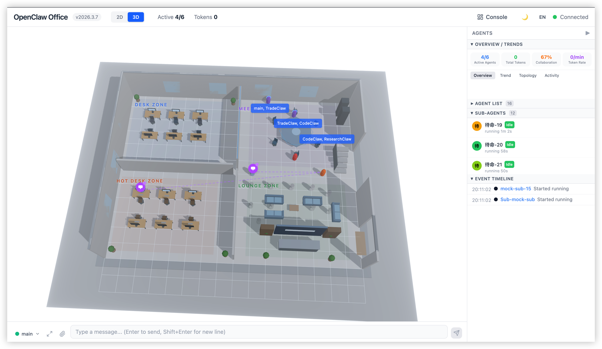

# ClawNexus Office — AI Agent Visualization & Management Platform

> **Real-time digital office visualization for multi-agent AI systems. Monitor, control, and collaborate with AI agents through an immersive 2D/3D interface.**

**ClawNexus Office** is a professional-grade visual monitoring and management frontend for the [OpenClaw](https://github.com/openclaw/openclaw) Multi-Agent system. It connects to the OpenClaw Gateway via WebSocket to visualize AI agent collaboration as a "digital office," providing real-time status monitoring, performance metrics, and full console management capabilities for enterprise AI deployments.

**Core Metaphor:** Agent = Digital Employee | Office = Agent Runtime | Desk = Session | Meeting Pod = Collaboration Context

---

## 🚀 Key Features

### Virtual Office — AI Agent Visualization Engine

Transform multi-agent AI systems into an interactive digital twin office environment:

- **2D Floor Plan** — SVG-rendered isometric office with desk zones, hot desks, meeting areas, and realistic furniture (desks, chairs, sofas, plants, coffee cups)
- **3D Scene** — React Three Fiber 3D office with character models, skill holograms, spawn portal effects, and post-processing visual effects
- **Dynamic Agent Avatars** — Deterministically generated SVG avatars from agent IDs with real-time status animations (idle, working, speaking, tool calling, error)
- **Collaboration Visualization** — Visual connections showing inter-agent message flow and session relationships
- **Live Speech Bubbles** — Real-time Markdown text streaming and tool call display with animation
- **Analytics Panels** — Agent details, token consumption charts, cost analysis pie charts, activity heatmaps, sub-agent relationship graphs, event timelines

### Real-time Chat Interface

Seamless communication with AI agents through a bottom-docked chat bar:

- **Multi-agent Selector** — Switch between agents in real-time
- **Streaming Message Display** — Watch AI responses generate in real-time with Markdown rendering
- **Chat History Drawer** — Timeline-based chat history with full conversation replay
- **Control Panel** — Send messages, abort runs, manage sessions




### Demo Video

<p align="center">
  <a href="https://www.youtube.com/watch?v=ACXSFTSlVLY">
    
  </a>
</p>

<p align="center">
  ▶ Click the preview image above to play on YouTube
</p>

[Watch Full Demo on YouTube](https://www.youtube.com/watch?v=ACXSFTSlVLY)

### Management Console — Full System Control

Professional-grade console interface for complete OpenClaw system management:

| Feature         | Capabilities                                                                                                    |
| --------------- | --------------------------------------------------------------------------------------------------------------- |
| **Dashboard**   | System overview, real-time stats, alert notifications, quick navigation, channel/skill status                  |
| **Agents**      | Agent creation/deletion/configuration, model management, tool policies, skill allowlists, file editor, cron job |
| **Channels**    | Channel configuration, stats monitoring, WhatsApp QR code binding, multi-channel integration                    |
| **Skills**      | Marketplace integration, skill discovery, installation management, dependency resolution, configuration        |
| **Cron Tasks**  | Scheduled task management, execution scheduling, statistics, real-time monitoring                              |
| **Settings**    | Provider management, API key configuration, model editor, appearance/theme, Gateway info, developer tools      |


### Enterprise Features

- **i18n Localization** — Complete Chinese/English bilingual support with runtime language switching
- **Mock Mode** — Develop without live Gateway connection using simulated data
- **Responsive Design** — Mobile-optimized with automatic 2D fallback for touch devices
- **Remote Gateway Support** — Connect to Aliyun, Tencent Cloud, or self-hosted OpenClaw deployments

---

## 💻 Tech Stack

**Modern, Production-Ready Technology Stack:**

| Layer            | Technology                                      |
| ---------------- | ----------------------------------------------- |
| **Build Tool**   | Vite 6                                          |
| **Framework**    | React 19 + TypeScript (strict mode)             |
| **2D Graphics**  | SVG + CSS Animations                            |
| **3D Graphics**  | React Three Fiber (R3F) + @react-three/drei     |
| **State Mgmt**   | Zustand 5 + Immer                               |
| **Styling**      | Tailwind CSS 4                                  |
| **Routing**      | React Router 7                                  |
| **Data Viz**     | Recharts                                        |
| **i18n**         | i18next + react-i18next                         |
| **Real-time**    | Native WebSocket (OpenClaw Gateway protocol)    |
| **Testing**      | Vitest + React Testing Library                  |

---

## 📋 System Requirements

- **Node.js 22+** — Latest LTS or current stable
- **pnpm** — Fast, reliable package manager
- **[OpenClaw](https://github.com/openclaw/openclaw)** — Installed and running (not included)

**Note:** ClawNexus Office is a companion frontend that connects to a running OpenClaw Gateway. It does **not** start or manage the Gateway itself.

---

## ⚡ Quick Start

### 1. Clone & Install

```bash
git clone <repository-url>
cd openclaw-office

pnpm install
```

### 2. Configure Gateway Connection

Create `.env.local` (gitignored) with your Gateway token:

```bash
cat > .env.local << 'EOF'
VITE_GATEWAY_TOKEN=<your-gateway-token>
EOF
```

Get your token:
```bash
openclaw config get gateway.auth.token
```

### 3. Enable Device Auth Bypass

Required for web client authentication:

```bash
openclaw config set gateway.controlUi.dangerouslyDisableDeviceAuth true
# Restart Gateway after this
```

### 4. Start Development Server

```bash
pnpm dev
```

Open `http://localhost:5180` in your browser.

---

## 🔧 Development Commands

```bash
pnpm install              # Install dependencies
pnpm dev                  # Start dev server (port 5180) with hot reload
pnpm build                # Production-optimized build
pnpm test                 # Run test suite
pnpm test:watch           # Watch mode testing
pnpm typecheck            # TypeScript validation
pnpm lint                 # Oxlint code analysis
pnpm format               # Oxfmt code formatting
pnpm check                # Combined lint + format check
```

---

## 🌐 Remote Gateway Support

ClawNexus Office supports both local and remote OpenClaw Gateway connections:

- **Local Gateway** — Auto-connect to Gateway running on your machine or LAN
- **Remote Gateway** — Connect to hosted OpenClaw environments (Aliyun, Tencent Cloud, custom deployments)

First launch shows a connection setup dialog. The browser connects through same-origin `/gateway-ws` proxy, while the Node proxy forwards to selected local or remote Gateway.

### Automatic Token Detection

If [OpenClaw](https://github.com/openclaw/openclaw) is installed locally, the Gateway auth token is **automatically detected** from `~/.openclaw/openclaw.json` — no manual setup required.

### CLI Options

```bash
openclaw-office [options]
```

| Flag                  | Description                       | Default                |
| --------------------- | --------------------------------- | ---------------------- |
| `-t, --token <token>` | Gateway authentication token      | auto-detected          |
| `-g, --gateway <url>` | Gateway WebSocket URL             | `ws://localhost:18789` |
| `-p, --port <port>`   | Server port                       | `5180`                 |
| `--host <host>`       | Bind address                      | `0.0.0.0`              |
| `-h, --help`          | Show help information             | —                      |

**Gateway URL Resolution Order:**
1. `--gateway` CLI flag
2. `OPENCLAW_GATEWAY_URL` environment variable
3. Persisted config at `~/.openclaw/openclaw-office.json`
4. Default `ws://localhost:18789`

---

## 📁 Project Architecture

```
openclaw-office/
├── src/
│   ├── main.tsx / App.tsx              # Entry point and routing
│   ├── i18n/                           # Internationalization (zh/en locales)
│   ├── gateway/                        # WebSocket communication
│   │   ├── ws-client.ts                # WebSocket client + auth + reconnect
│   │   ├── rpc-client.ts               # RPC request wrapper
│   │   ├── event-parser.ts             # Event parsing + state mapping
│   │   ├── adapter.ts                  # Adapter pattern (real/mock)
│   │   └── mock-adapter.ts             # Mock data for development
│   ├── store/                          # Zustand state management
│   │   ├── office-store.ts             # Main store (agents, metrics, UI state)
│   │   ├── agent-reducer.ts            # Agent state transitions
│   │   ├── metrics-reducer.ts          # Performance metrics
│   │   └── console-stores/             # Per-page console stores
│   ├── components/
│   │   ├── layout/                     # AppShell, ConsoleLayout, Sidebar
│   │   ├── office-2d/                  # 2D SVG floor plan components
│   │   ├── office-3d/                  # 3D R3F scene components
│   │   ├── overlays/                   # HTML overlays (speech bubbles)
│   │   ├── panels/                     # Metrics and detail panels
│   │   ├── chat/                       # Chat dock bar components
│   │   ├── console/                    # Management console features
│   │   ├── pages/                      # Console route pages
│   │   └── shared/                     # Reusable UI components
│   ├── hooks/                          # Custom React hooks
│   ├── lib/                            # Utility functions
│   └── styles/                         # Global CSS and themes
├── public/                             # Static assets
├── tests/                              # Test files
└── config files (vite, ts, etc.)
```

---

## 🏗️ System Architecture

**Data Flow:** OpenClaw Gateway → WebSocket → Event Parser → Zustand Store → React Components

```
OpenClaw Gateway
    │
    ├─ WebSocket Events ──> ws-client.ts ──> event-parser.ts ──┐
    │                                                            ├──> Zustand Store ──> Components
    └─ RPC Methods ──────> rpc-client.ts ──────────────────────┘
```

**Event Processing Pipeline:**
1. Gateway broadcasts real-time events (`agent`, `presence`, `health`, `heartbeat`)
2. Event parser maps Agent lifecycle events to visual states (idle, working, speaking, tool_calling, error)
3. Zustand store updates application state atomically
4. React components re-render with new agent states and metrics

---

## 🔌 Environment Variables

| Variable             | Required                              | Default                | Purpose                              |
| -------------------- | ------------------------------------- | ---------------------- | ------------------------------------ |
| `VITE_GATEWAY_TOKEN` | Yes (for real Gateway)                | —                      | OpenClaw Gateway auth token          |
| `VITE_GATEWAY_URL`   | No                                    | `ws://localhost:18789` | Dev proxy upstream Gateway address   |
| `VITE_MOCK`          | No                                    | `false`                | Enable mock mode (no Gateway needed) |
| `VITE_CLAWHUB_REGISTRY` | No                               | `https://clawhub.com`  | ClawHub marketplace registry URL     |

### Mock Mode

Develop without a running Gateway using simulated data:

```bash
VITE_MOCK=true pnpm dev
```

---

## 📊 Performance Optimizations

- **Code Splitting** — Route-based lazy loading for console pages
- **Virtual Scrolling** — Efficient rendering of large agent lists
- **Memoization** — Zustand subscriptions prevent unnecessary re-renders
- **Asset Optimization** — WebP images with PNG fallbacks
- **Bundle Analysis** — Built-in Vite visualization plugin

---

## 🌍 Internationalization

Full bilingual support with runtime language switching:

- **English** — `src/i18n/locales/en/`
- **Chinese** — `src/i18n/locales/zh/`

All user-visible text uses i18n namespaces: `common`, `layout`, `office`, `panels`, `chat`, `console`

---

## 🧪 Testing

```bash
# Run all tests
pnpm test

# Watch mode
pnpm test:watch

# Coverage report
pnpm test:coverage
```

**Test Requirements:**
- Store logic and event parsing must have unit tests
- Critical user flows tested with React Testing Library
- E2E scenarios for connection/disconnection/reconnection

---

## 📝 License & Attribution

**© 2026 [Prantik Medhi](https://github.com/prantikmedhi)**

All code, design, and documentation are created and maintained by Prantik Medhi. Licensed under [MIT](./LICENSE).

This project is a frontend for the [OpenClaw](https://github.com/openclaw/openclaw) multi-agent framework.

---

## 🤝 Contributing

Contributions welcome! Please follow the coding standards in [CLAUDE.md](./CLAUDE.md).

- Fork the repository
- Create a feature branch (`git checkout -b feature/amazing-feature`)
- Commit changes following Conventional Commits
- Push to your fork and open a Pull Request

---

## 📚 Documentation

- **[Architecture Guide](./CLAUDE.md)** — Detailed development guide for AI assistants
- **[Project Structure](./README.md#-project-architecture)** — File organization and module breakdown
- **[OpenClaw Docs](https://github.com/openclaw/openclaw)** — Gateway protocol and API reference

---

## 🐛 Troubleshooting

### Can't Connect to Gateway?

1. Verify Gateway is running: `openclaw gateway status`
2. Check token: `openclaw config get gateway.auth.token`
3. Enable device auth bypass: `openclaw config set gateway.controlUi.dangerouslyDisableDeviceAuth true`
4. Restart Gateway after configuration changes

### Port 5180 Already in Use?

```bash
pnpm dev -- --port 5181
```

### TypeScript Errors?

```bash
pnpm typecheck
# Check tsconfig.json for strict mode settings
```

---

## 📞 Support

For issues related to:

- **ClawNexus Office UI/UX** — Open an issue on this repository
- **OpenClaw Gateway** — See [OpenClaw repository](https://github.com/openclaw/openclaw)
- **General questions** — Check documentation in [CLAUDE.md](./CLAUDE.md)

---

**Made with ❤️ by [Prantik Medhi](https://github.com/prantikmedhi) | [Website](https://prantikmedhi.dev)**

## Architecture Priorities

- Keep Office as the same-origin control surface so browsers never need direct knowledge of Gateway topology.
- Treat visualization quality, control-plane reliability, and operator trust as co-equal product requirements.
- Prefer runtime configurability, observable defaults, and graceful degradation over brittle environment-specific branching.

## Advanced Delivery Checklist

- Validate both local development and remote-hosted Office deployments before considering a feature finished.
- Exercise degraded states: upstream Gateway unavailable, stale persisted config, reconnect storms, streaming interruption, and partial data.
- Ensure every new UI surface ships with i18n coverage, loading states, empty states, and operator-facing error feedback.

## Extension Strategy

- Add new Gateway capabilities through adapters and event parsing layers before attaching UI affordances.
- Model analytics panels as derived state so rendering layers stay presentational and easier to test.
- When adding new office metaphors, define the domain event, visual state mapping, and console counterpart together.
